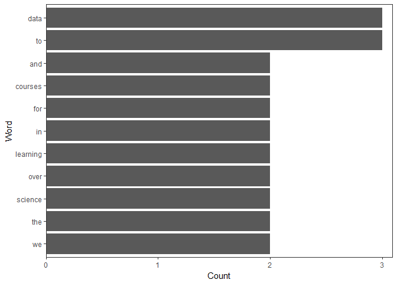

Quick Taste of Text Mining
================
Mark Blackmore
2018-01-03

### Quick Overview

``` r
# Load qdap
suppressWarnings(
  suppressPackageStartupMessages(
    library(qdap)
  )
)

new_text <- "DataCamp is the first online learning platform that focuses on building the best learning experience specifically for Data Science. We have offices in Boston and Belgium and to date, we trained over 250,000 (aspiring) data scientists in over 150 countries. These data science enthusiasts completed more than 9 million exercises. You can take free beginner courses, or subscribe for $25/month to get access to all premium courses."

# Print new_text to the console
print(new_text)
```

    ## [1] "DataCamp is the first online learning platform that focuses on building the best learning experience specifically for Data Science. We have offices in Boston and Belgium and to date, we trained over 250,000 (aspiring) data scientists in over 150 countries. These data science enthusiasts completed more than 9 million exercises. You can take free beginner courses, or subscribe for $25/month to get access to all premium courses."

``` r
# Find the 10 most frequent terms: term_count
term_count <- freq_terms(new_text, 10)

# Plot term_count
plot(term_count)
```



### Load Some Text

``` r
# Import text data
tweets <- read.csv("./data/coffee.csv", stringsAsFactors = FALSE)

# View the structure of tweets
str(tweets)
```

    ## 'data.frame':    1000 obs. of  15 variables:
    ##  $ num         : int  1 2 3 4 5 6 7 8 9 10 ...
    ##  $ text        : chr  "@ayyytylerb that is so true drink lots of coffee" "RT @bryzy_brib: Senior March tmw morning at 7:25 A.M. in the SENIOR lot. Get up early, make yo coffee/breakfast"| __truncated__ "If you believe in #gunsense tomorrow would be a very good day to have your coffee any place BUT @Starbucks Guns"| __truncated__ "My cute coffee mug. http://t.co/2udvMU6XIG" ...
    ##  $ favorited   : logi  FALSE FALSE FALSE FALSE FALSE FALSE ...
    ##  $ replyToSN   : chr  "ayyytylerb" NA NA NA ...
    ##  $ created     : chr  "8/9/2013 2:43" "8/9/2013 2:43" "8/9/2013 2:43" "8/9/2013 2:43" ...
    ##  $ truncated   : logi  FALSE FALSE FALSE FALSE FALSE FALSE ...
    ##  $ replyToSID  : num  3.66e+17 NA NA NA NA ...
    ##  $ id          : num  3.66e+17 3.66e+17 3.66e+17 3.66e+17 3.66e+17 ...
    ##  $ replyToUID  : int  1637123977 NA NA NA NA NA NA 1316942208 NA NA ...
    ##  $ statusSource: chr  "<a href=\"http://twitter.com/download/iphone\" rel=\"nofollow\">Twitter for iPhone</a>" "<a href=\"http://twitter.com/download/iphone\" rel=\"nofollow\">Twitter for iPhone</a>" "web" "<a href=\"http://twitter.com/download/android\" rel=\"nofollow\">Twitter for Android</a>" ...
    ##  $ screenName  : chr  "thejennagibson" "carolynicosia" "janeCkay" "AlexandriaOOTD" ...
    ##  $ retweetCount: int  0 1 0 0 2 0 0 0 1 2 ...
    ##  $ retweeted   : logi  FALSE FALSE FALSE FALSE FALSE FALSE ...
    ##  $ longitude   : logi  NA NA NA NA NA NA ...
    ##  $ latitude    : logi  NA NA NA NA NA NA ...

``` r
# Print out the number of rows in tweets
nrow(tweets)
```

    ## [1] 1000

``` r
# Isolate text from tweets: coffee_tweets
coffee_tweets <- tweets$text
```

### Make the Vector a VCrorpus Object (1)

``` r
# Load tm
suppressWarnings(
  suppressPackageStartupMessages(
    library(tm)
    )
)

# Make a vector source: coffee_source
coffee_source <- VectorSource(coffee_tweets)
```

### Make the Vector a VCrorpus Object (2)

``` r
# Make a volatile corpus: coffee_corpus
coffee_corpus <- VCorpus(coffee_source)

# Print out coffee_corpus
coffee_corpus
```

    ## <<VCorpus>>
    ## Metadata:  corpus specific: 0, document level (indexed): 0
    ## Content:  documents: 1000

``` r
# Print data on the 15th tweet in coffee_corpus
coffee_corpus[[15]]
```

    ## <<PlainTextDocument>>
    ## Metadata:  7
    ## Content:  chars: 111

``` r
# Print the content of the 15th tweet in coffee_corpus
coffee_corpus[[15]]$content
```

    ## [1] "@HeatherWhaley I was about 2 joke it takes 2 hands to hold hot coffee...then I read headline! #Don'tDrinkNShoot"

### Make A VCorpus from a Data frame
