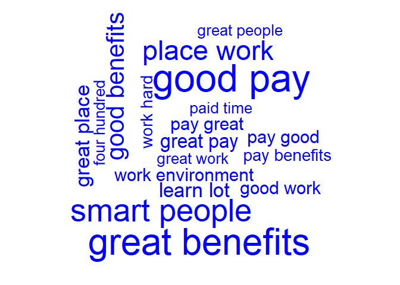

Battle of the tech giants for talent
================
Mark Blackmore
2018-01-10

-   [Identifying the text sources](#identifying-the-text-sources)
-   [Text organization](#text-organization)
-   [Working with Google reviews](#working-with-google-reviews)
-   [Feature extraction & analysis: amzn\_pros](#feature-extraction-analysis-amzn_pros)

``` r
# Load Packages
suppressWarnings(
  suppressPackageStartupMessages({
    library(qdap)
    library(tm)
    library(wordcloud)
    library(dendextend)
    library(tidyverse)
    library(RWeka)
  })
)
```

### Identifying the text sources

``` r
amzn <- read.csv("./data/500_amzn.csv", stringsAsFactors = FALSE)
goog <- read.csv("./data/500_goog.csv", stringsAsFactors = FALSE)

# Print the structure of amzn
str(amzn)
```

    ## 'data.frame':    500 obs. of  4 variables:
    ##  $ pg_num: int  50 50 50 50 50 50 50 50 50 50 ...
    ##  $ url   : chr  "https://www.glassdoor.com/Reviews/Amazon-com-Reviews-E6036_P50.htm" "https://www.glassdoor.com/Reviews/Amazon-com-Reviews-E6036_P50.htm" "https://www.glassdoor.com/Reviews/Amazon-com-Reviews-E6036_P50.htm" "https://www.glassdoor.com/Reviews/Amazon-com-Reviews-E6036_P50.htm" ...
    ##  $ pros  : chr  "You're surrounded by smart people and the projects are interesting, if a little daunting." "Brand name is great. Have yet to meet somebody who is unfamiliar with Amazon. Hours weren't as bad as I had pre"| __truncated__ "Good money.Interaction with some great minds in the world during internal conferences and sessions.Of course th"| __truncated__ "nice pay and overtime and different shifts" ...
    ##  $ cons  : chr  "Internal tools proliferation has created a mess for trying to get to basic information. Most people are require"| __truncated__ "not the most stimulating work. Good brand name to work for but the work itself is mundane as it can get. As a f"| __truncated__ "No proper growth plan for employees.Difficult promotion process requiring a lot more documentation than your ac"| __truncated__ "didn't last quite long enough" ...

``` r
# Create amzn_pros
amzn_pros <- amzn$pros

# Create amzn_cons
amzn_cons <- amzn$cons

# Print the structure of goog
str(goog)
```

    ## 'data.frame':    501 obs. of  4 variables:
    ##  $ pg_num: int  1 1 1 1 1 1 1 1 1 1 ...
    ##  $ url   : chr  "https://www.glassdoor.com/Reviews/Google-Reviews-E9079_P1.htm" "https://www.glassdoor.com/Reviews/Google-Reviews-E9079_P1.htm" "https://www.glassdoor.com/Reviews/Google-Reviews-E9079_P1.htm" "https://www.glassdoor.com/Reviews/Google-Reviews-E9079_P1.htm" ...
    ##  $ pros  : chr  "* If you're a software engineer, you're among the kings of the hill at Google. It's an engineer-driven company "| __truncated__ "1) Food, food, food. 15+ cafes on main campus (MTV) alone. Mini-kitchens, snacks, drinks, free breakfast/lunch/"| __truncated__ "You can't find a more well-regarded company that actually deserves the hype it gets." "- You drive yourself here. If you want to grow, you have to seek out opportunities and prove that your worth. T"| __truncated__ ...
    ##  $ cons  : chr  "* It *is* becoming larger, and with it comes growing pains: bureaucracy, slow to respond to market threats, blo"| __truncated__ "1) Work/life balance. What balance? All those perks and benefits are an illusion. They keep you at work and the"| __truncated__ "I live in SF so the commute can take between 1.5 hours to 1.75 hours each way on the shuttle - sometimes 2 hour"| __truncated__ "- Google is a big company. So there are going to be winners and losers when it comes to career growth. Due to t"| __truncated__ ...

``` r
# Create goog_pros
goog_pros <- goog$pros

# Create goog_cons
goog_cons <- goog$cons
```

### Text organization

``` r
qdap_clean <- function(x){
  x <- replace_abbreviation(x)
  x <- replace_contraction(x)
  x <- replace_number(x)
  x <- replace_ordinal(x)
  x <- replace_ordinal(x)
  x <- replace_symbol(x)
  x <- tolower(x)
  return(x)
}
tm_clean <- function(corpus){
  corpus <- tm_map(corpus, removePunctuation)
  corpus <- tm_map(corpus, stripWhitespace)
  corpus <- tm_map(corpus, removeWords, 
                   c(stopwords("en"), "Google", "Amazon", "company"))
  return(corpus)
}

# Alter amzn_pros
amzn_pros <- qdap_clean(amzn_pros)

# Alter amzn_cons
amzn_cons <- qdap_clean(amzn_cons)

# Create az_p_corp
```

Need to add a line to address NA's

``` r
amzn_pros[which(is.na(amzn_pros))] <- "NULLVALUEENTERED"
az_p_corp <- VCorpus(VectorSource(amzn_pros))

# Create az_c_corp
```

Need to add a line to address NA's

``` r
amzn_cons[which(is.na(amzn_cons))] <- "NULLVALUEENTERED"
az_c_corp <- VCorpus(VectorSource(amzn_cons))

# Create amzn_pros_corp
amzn_pros_corp <- tm_clean(az_p_corp)

# Create amzn_cons_corp
amzn_cons_corp <- tm_clean(az_c_corp)  
```

### Working with Google reviews

``` r
# Apply qdap_clean to goog_pros
goog_pros <- qdap_clean(goog_pros)

# Apply qdap_clean to goog_cons
goog_cons <- qdap_clean(goog_cons)

# Create goog_p_corp
```

Need to add a line to address NA's

``` r
goog_pros[which(is.na(goog_pros))] <- "NULLVALUEENTERED"
goog_p_corp <- VCorpus(VectorSource(goog_pros))

# Create goog_c_corp
```

Need to add a line to address NA's

``` r
goog_cons[which(is.na(goog_cons))] <- "NULLVALUEENTERED"
goog_c_corp <- VCorpus(VectorSource(goog_cons))

# Create goog_pros_corp
goog_pros_corp <- tm_clean(goog_p_corp)

# Create goog_cons_corp
goog_cons_corp <- tm_clean(goog_c_corp)
```

### Feature extraction & analysis: amzn\_pros

``` r
tokenizer <- function(x) 
  NGramTokenizer(x, Weka_control(min = 2, max = 2))

# Create amzn_p_tdm
amzn_p_tdm <- TermDocumentMatrix(amzn_pros_corp, control = list(tokenize = tokenizer))

# Create amzn_p_tdm_m
amzn_p_tdm_m <- as.matrix(amzn_p_tdm)

# Create amzn_p_freq
amzn_p_freq <- rowSums(amzn_p_tdm_m)

# Plot a wordcloud using amzn_p_freq values
wordcloud(names(amzn_p_freq), amzn_p_freq, max.words = 25, color = "blue")
```

    ## Warning in wordcloud(names(amzn_p_freq), amzn_p_freq, max.words = 25, color
    ## = "blue"): fast paced could not be fit on page. It will not be plotted.

    ## Warning in wordcloud(names(amzn_p_freq), amzn_p_freq, max.words = 25, color
    ## = "blue"): pay good could not be fit on page. It will not be plotted.

    ## Warning in wordcloud(names(amzn_p_freq), amzn_p_freq, max.words = 25, color
    ## = "blue"): great place could not be fit on page. It will not be plotted.

    ## Warning in wordcloud(names(amzn_p_freq), amzn_p_freq, max.words = 25, color
    ## = "blue"): people work could not be fit on page. It will not be plotted.

    ## Warning in wordcloud(names(amzn_p_freq), amzn_p_freq, max.words = 25, color
    ## = "blue"): pay benefits could not be fit on page. It will not be plotted.

    ## Warning in wordcloud(names(amzn_p_freq), amzn_p_freq, max.words = 25, color
    ## = "blue"): decent pay could not be fit on page. It will not be plotted.


