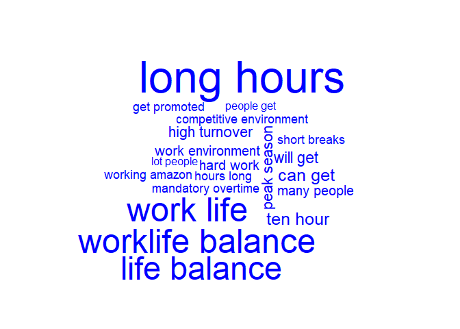
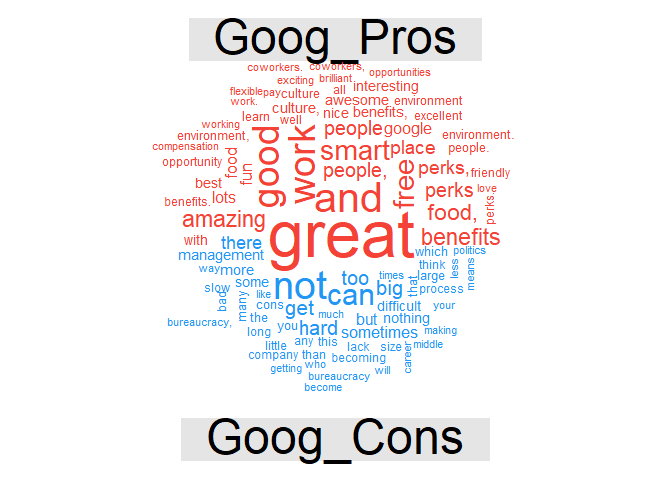
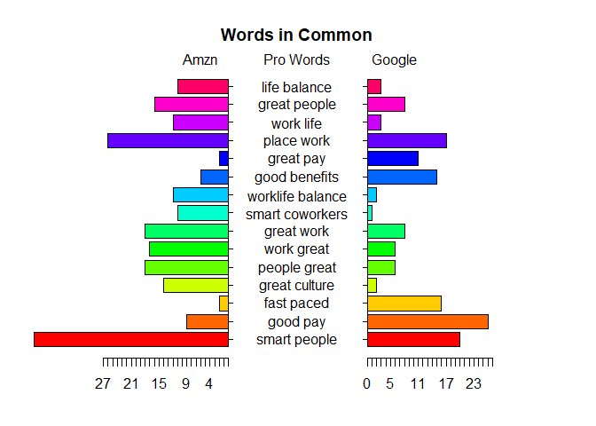

Battle of the tech giants for talent
================
Mark Blackmore
2018-01-11

-   [Identifying the text sources](#identifying-the-text-sources)
-   [Text organization](#text-organization)
-   [Working with Google reviews](#working-with-google-reviews)
-   [Feature extraction & analysis: amzn\_pros](#feature-extraction-analysis-amzn_pros)
-   [Feature extraction & analysis: amzn\_cons](#feature-extraction-analysis-amzn_cons)
-   [amzn\_cons dendrogram](#amzn_cons-dendrogram)
-   [word association](#word-association)
-   [Quick review of Google reviews](#quick-review-of-google-reviews)
-   [Cage match! Amazon vs. Google pro reviews](#cage-match-amazon-vs.-google-pro-reviews)
-   [Cage match! Amazon vs. Google con reviews](#cage-match-amazon-vs.-google-con-reviews)

``` r
# Load Packages
suppressWarnings(
  suppressPackageStartupMessages({
    library(qdap)
    library(tm)
    library(wordcloud)
    library(dendextend)
    library(tidyverse)
    library(RWeka)
    library(plotrix)
  })
)
```

### Identifying the text sources

``` r
amzn <- read.csv("./data/500_amzn.csv", stringsAsFactors = FALSE)
goog <- read.csv("./data/500_goog.csv", stringsAsFactors = FALSE)

# Print the structure of amzn
str(amzn)
```

    ## 'data.frame':    500 obs. of  4 variables:
    ##  $ pg_num: int  50 50 50 50 50 50 50 50 50 50 ...
    ##  $ url   : chr  "https://www.glassdoor.com/Reviews/Amazon-com-Reviews-E6036_P50.htm" "https://www.glassdoor.com/Reviews/Amazon-com-Reviews-E6036_P50.htm" "https://www.glassdoor.com/Reviews/Amazon-com-Reviews-E6036_P50.htm" "https://www.glassdoor.com/Reviews/Amazon-com-Reviews-E6036_P50.htm" ...
    ##  $ pros  : chr  "You're surrounded by smart people and the projects are interesting, if a little daunting." "Brand name is great. Have yet to meet somebody who is unfamiliar with Amazon. Hours weren't as bad as I had pre"| __truncated__ "Good money.Interaction with some great minds in the world during internal conferences and sessions.Of course th"| __truncated__ "nice pay and overtime and different shifts" ...
    ##  $ cons  : chr  "Internal tools proliferation has created a mess for trying to get to basic information. Most people are require"| __truncated__ "not the most stimulating work. Good brand name to work for but the work itself is mundane as it can get. As a f"| __truncated__ "No proper growth plan for employees.Difficult promotion process requiring a lot more documentation than your ac"| __truncated__ "didn't last quite long enough" ...

``` r
# Create amzn_pros
amzn_pros <- amzn$pros

# Create amzn_cons
amzn_cons <- amzn$cons

# Print the structure of goog
str(goog)
```

    ## 'data.frame':    501 obs. of  4 variables:
    ##  $ pg_num: int  1 1 1 1 1 1 1 1 1 1 ...
    ##  $ url   : chr  "https://www.glassdoor.com/Reviews/Google-Reviews-E9079_P1.htm" "https://www.glassdoor.com/Reviews/Google-Reviews-E9079_P1.htm" "https://www.glassdoor.com/Reviews/Google-Reviews-E9079_P1.htm" "https://www.glassdoor.com/Reviews/Google-Reviews-E9079_P1.htm" ...
    ##  $ pros  : chr  "* If you're a software engineer, you're among the kings of the hill at Google. It's an engineer-driven company "| __truncated__ "1) Food, food, food. 15+ cafes on main campus (MTV) alone. Mini-kitchens, snacks, drinks, free breakfast/lunch/"| __truncated__ "You can't find a more well-regarded company that actually deserves the hype it gets." "- You drive yourself here. If you want to grow, you have to seek out opportunities and prove that your worth. T"| __truncated__ ...
    ##  $ cons  : chr  "* It *is* becoming larger, and with it comes growing pains: bureaucracy, slow to respond to market threats, blo"| __truncated__ "1) Work/life balance. What balance? All those perks and benefits are an illusion. They keep you at work and the"| __truncated__ "I live in SF so the commute can take between 1.5 hours to 1.75 hours each way on the shuttle - sometimes 2 hour"| __truncated__ "- Google is a big company. So there are going to be winners and losers when it comes to career growth. Due to t"| __truncated__ ...

``` r
# Create goog_pros
goog_pros <- goog$pros

# Create goog_cons
goog_cons <- goog$cons
```

### Text organization

``` r
qdap_clean <- function(x){
  x <- replace_abbreviation(x)
  x <- replace_contraction(x)
  x <- replace_number(x)
  x <- replace_ordinal(x)
  x <- replace_ordinal(x)
  x <- replace_symbol(x)
  x <- tolower(x)
  return(x)
}
tm_clean <- function(corpus){
  corpus <- tm_map(corpus, removePunctuation)
  corpus <- tm_map(corpus, stripWhitespace)
  corpus <- tm_map(corpus, removeWords, 
                   c(stopwords("en"), "Google", "Amazon", "company"))
  return(corpus)
}

# Alter amzn_pros
amzn_pros <- qdap_clean(amzn_pros)

# Alter amzn_cons
amzn_cons <- qdap_clean(amzn_cons)

# Create az_p_corp
```

Need to add a line to address NA's

``` r
amzn_pros[which(is.na(amzn_pros))] <- "NULLVALUEENTERED"
az_p_corp <- VCorpus(VectorSource(amzn_pros))

# Create az_c_corp
```

Need to add a line to address NA's

``` r
amzn_cons[which(is.na(amzn_cons))] <- "NULLVALUEENTERED"
az_c_corp <- VCorpus(VectorSource(amzn_cons))

# Create amzn_pros_corp
amzn_pros_corp <- tm_clean(az_p_corp)

# Create amzn_cons_corp
amzn_cons_corp <- tm_clean(az_c_corp)  
```

### Working with Google reviews

``` r
# Apply qdap_clean to goog_pros
goog_pros <- qdap_clean(goog_pros)

# Apply qdap_clean to goog_cons
goog_cons <- qdap_clean(goog_cons)

# Create goog_p_corp
```

Need to add a line to address NA's

``` r
goog_pros[which(is.na(goog_pros))] <- "NULLVALUEENTERED"
goog_p_corp <- VCorpus(VectorSource(goog_pros))

# Create goog_c_corp
```

Need to add a line to address NA's

``` r
goog_cons[which(is.na(goog_cons))] <- "NULLVALUEENTERED"
goog_c_corp <- VCorpus(VectorSource(goog_cons))

# Create goog_pros_corp
goog_pros_corp <- tm_clean(goog_p_corp)

# Create goog_cons_corp
goog_cons_corp <- tm_clean(goog_c_corp)
```

### Feature extraction & analysis: amzn\_pros

``` r
tokenizer <- function(x) 
  NGramTokenizer(x, Weka_control(min = 2, max = 2))

# Create amzn_p_tdm
amzn_p_tdm <- TermDocumentMatrix(amzn_pros_corp, control = list(tokenize = tokenizer))

# Create amzn_p_tdm_m
amzn_p_tdm_m <- as.matrix(amzn_p_tdm)

# Create amzn_p_freq
amzn_p_freq <- rowSums(amzn_p_tdm_m)

# Plot a wordcloud using amzn_p_freq values
wordcloud(names(amzn_p_freq), amzn_p_freq, max.words = 20, color = "blue")
```

    ## Warning in wordcloud(names(amzn_p_freq), amzn_p_freq, max.words = 20, color
    ## = "blue"): good pay could not be fit on page. It will not be plotted.

    ## Warning in wordcloud(names(amzn_p_freq), amzn_p_freq, max.words = 20, color
    ## = "blue"): great benefits could not be fit on page. It will not be plotted.


### Feature extraction & analysis: amzn\_cons

``` r
# Create amzn_c_tdm
amzn_c_tdm <- TermDocumentMatrix(amzn_cons_corp, control = list(tokenize = tokenizer))

# Create amzn_c_tdm_m
amzn_c_tdm_m <- as.matrix(amzn_c_tdm)

# Create amzn_c_freq
amzn_c_freq <- rowSums(amzn_c_tdm_m)

# Plot a wordcloud using amzn_c_freq values
wordcloud(names(amzn_c_freq), amzn_c_freq, max.words = 20, color = "blue")
```



### amzn\_cons dendrogram

``` r
# Print amzn_c_tdm to the console
amzn_c_tdm
```

    ## <<TermDocumentMatrix (terms: 4778, documents: 500)>>
    ## Non-/sparse entries: 5220/2383780
    ## Sparsity           : 100%
    ## Maximal term length: 31
    ## Weighting          : term frequency (tf)

``` r
# Create amzn_c_tdm2 by removing sparse terms 
amzn_c_tdm2 <- removeSparseTerms(amzn_c_tdm, sparse = 0.993)
amzn_c_tdm2
```

    ## <<TermDocumentMatrix (terms: 31, documents: 500)>>
    ## Non-/sparse entries: 226/15274
    ## Sparsity           : 99%
    ## Maximal term length: 23
    ## Weighting          : term frequency (tf)

``` r
# Create hc as a cluster of distance values
hc <- hclust(dist(amzn_c_tdm2, method = "euclidean"), method = "complete")

# Produce a plot of hc
plot(hc)
```


### word association

``` r
# Create amzn_p_tdm
amzn_p_tdm <- TermDocumentMatrix(amzn_pros_corp, control = list(tokenize = tokenizer))

# Create amzn_p_m
amzn_p_m <- as.matrix(amzn_p_tdm)

# Create amzn_p_freq
amzn_p_freq <- rowSums(amzn_p_m)

# Create term_frequency
term_frequency <- sort(amzn_p_freq, decreasing = TRUE)

# Print the 5 most common terms
term_frequency[1:5]
```

    ##       good pay great benefits   smart people     place work     fast paced 
    ##             25             24             20             17             16

``` r
# Find associations with fast paced
findAssocs(amzn_p_tdm, "fast paced", 0.2)
```

    ## $`fast paced`
    ##        paced environment        environments ever               learn fast 
    ##                     0.49                     0.35                     0.35 
    ##           paced friendly               paced work               able excel 
    ##                     0.35                     0.35                     0.25 
    ##           activity ample              advance one                also well 
    ##                     0.25                     0.25                     0.25 
    ##              amazon fast            amazon noting               amazon one 
    ##                     0.25                     0.25                     0.25 
    ##              amount time        ample opportunity        assistance ninety 
    ##                     0.25                     0.25                     0.25 
    ##       benefits including           break computer            call activity 
    ##                     0.25                     0.25                     0.25 
    ##               can choose            catchy cheers            center things 
    ##                     0.25                     0.25                     0.25 
    ##       challenging expect       cheers opportunity           choose success 
    ##                     0.25                     0.25                     0.25 
    ##   combined encouragement competitive environments            computer room 
    ##                     0.25                     0.25                     0.25 
    ##              cool things          deliver results               dock makes 
    ##                     0.25                     0.25                     0.25 
    ##           driven deliver               easy learn        emphasis shipping 
    ##                     0.25                     0.25                     0.25 
    ## encouragement innovation     environment benefits       environment catchy 
    ##                     0.25                     0.25                     0.25 
    ##       environment center         environment fast         environment help 
    ##                     0.25                     0.25                     0.25 
    ##        environment smart               ever known           ever witnessed 
    ##                     0.25                     0.25                     0.25 
    ##        everchanging fast    everyones preferences            excel advance 
    ##                     0.25                     0.25                     0.25 
    ##       excel everchanging     exciting environment             expect learn 
    ##                     0.25                     0.25                     0.25 
    ##           extremely fast             facility top          fail successful 
    ##                     0.25                     0.25                     0.25 
    ##           fantastic able               fired part             five percent 
    ##                     0.25                     0.25                     0.25 
    ##           freindly place      friendly atmosphere      friendly management 
    ##                     0.25                     0.25                     0.25 
    ##             full medical                get fired             go extremely 
    ##                     0.25                     0.25                     0.25 
    ##             great plenty           great teamwork     happening technology 
    ##                     0.25                     0.25                     0.25 
    ##          hassle benefits                 help get             help workers 
    ##                     0.25                     0.25                     0.25 
    ##             high quality              high volume           including full 
    ##                     0.25                     0.25                     0.25 
    ##        innovation owning         job requirements               leader can 
    ##                     0.25                     0.25                     0.25 
    ##               line break       lot responsibility         maintaining high 
    ##                     0.25                     0.25                     0.25 
    ##               makes time          management nice            nice facility 
    ##                     0.25                     0.25                     0.25 
    ##              ninety five             noting short       offers opportunity 
    ##                     0.25                     0.25                     0.25 
    ##          one competitive                 one fast     opportunity overtime 
    ##                     0.25                     0.25                     0.25 
    ##         opportunity yell           ownership fast              owning work 
    ##                     0.25                     0.25                     0.25 
    ##           paced emphasis           paced exciting               paced high 
    ##                     0.25                     0.25                     0.25 
    ##              paced never          paced rewarding               paced ship 
    ##                     0.25                     0.25                     0.25 
    ##           paced software             paid upfront           people focused 
    ##                     0.25                     0.25                     0.25 
    ##             percent paid            plenty shifts            position fast 
    ##                     0.25                     0.25                     0.25 
    ##           possible still         preferences fast         products quickly 
    ##                     0.25                     0.25                     0.25 
    ##              quality bar         quickly possible        readily available 
    ##                     0.25                     0.25                     0.25 
    ##        requirements easy responsibility ownership            results great 
    ##                     0.25                     0.25                     0.25 
    ##             results team         rewarding people         shifts everyones 
    ##                     0.25                     0.25                     0.25 
    ##                ship dock        shipping products             short amount 
    ##                     0.25                     0.25                     0.25 
    ##          short fantastic          smart coworkers        still maintaining 
    ##                     0.25                     0.25                     0.25 
    ##             success fail          successful also              team driven 
    ##                     0.25                     0.25                     0.25 
    ##         technology today         things happening               things lot 
    ##                     0.25                     0.25                     0.25 
    ##                time fast                  time go                 top line 
    ##                     0.25                     0.25                     0.25 
    ##       upfront experience              vision well              volume call 
    ##                     0.25                     0.25                     0.25 
    ##            well rewarded             well tuition       witnessed combined 
    ##                     0.25                     0.25                     0.25 
    ##                 work can                work cool        work environments 
    ##                     0.25                     0.25                     0.25 
    ##                work fast                 work job          workers readily 
    ##                     0.25                     0.25                     0.25 
    ##              yell leader 
    ##                     0.25

### Quick review of Google reviews

``` r
# Create g_pros
g_pros <- paste(goog_pros, collapse = " ")

# Create g_cons
g_cons <- paste(goog_cons, collapse = " ")

# Create all_goog
all_goog <- c(g_pros, g_cons)
all_goog_corpus <- VCorpus(VectorSource(all_goog))

# Create all_goog_corp
all_goog_corp <- tm_clean(all_goog_corpus)

# Create all_tdm
all_tdm <- TermDocumentMatrix(all_goog_corpus)

# Name the columns of all_tdm
colnames(all_tdm) <- c("Goog_Pros", "Goog_Cons")

# Create all_m
all_m <- as.matrix(all_tdm)

# Build a comparison cloud
comparison.cloud(all_m, colors = c("#F44336", "#2196f3"), max.words = 100)
```



### Cage match! Amazon vs. Google pro reviews

``` r
# Create a_pros
a_pros <- paste(amzn_pros, collapse = " ")

# Create all_pros
all_pros <- c(g_pros, a_pros)
all_pros_corpus <- VCorpus(VectorSource(all_pros))

# Create all_pros_corp
all_pros_corp <- tm_clean(all_pros_corpus)

# Create all_tdm
all_tdm <- TermDocumentMatrix(all_pros_corp, control = list(tokenize = tokenizer))

# Name the columns of all_tdm
colnames(all_tdm) <- c("Amazon_Pro", "Google_Pro")

all_tdm_m <- as.matrix(all_tdm)
head(all_tdm_m)
```

    ##                   Docs
    ## Terms              Amazon_Pro Google_Pro
    ##   ability customer          0          1
    ##   ability iterate           0          1
    ##   ability make              1          1
    ##   ability see               0          1
    ##   ability switch            1          0
    ##   ability travel            1          0

``` r
# Create common_words
common_words <- subset(all_tdm_m, all_tdm_m[, 1] > 0 & all_tdm_m[, 2] > 0)

# Create difference
difference <- abs(common_words[,1] - common_words[,2])

# Add difference to common_words
common_words <- cbind(common_words,difference)

# Order the data frame from most differences to least
common_words <- common_words[order(common_words[,3], decreasing = TRUE), ]

# Create top15_df
top15_df <- data.frame(x = common_words[1:15, 1],
                       y = common_words[1:15, 2],
                       labels = rownames(common_words[1:15, ]))

# Create the pyramid plot
pyramid.plot(top15_df$x, top15_df$y, 
             labels = top15_df$labels, gap = 15, 
             top.labels = c("Amzn", "Pro Words", "Google"), 
             main = "Words in Common", unit = NULL)
```



    ## [1] 5.1 4.1 4.1 2.1

### Cage match! Amazon vs. Google con reviews

``` r
# Create a_cons
a_cons <- paste(amzn_cons, collapse = " ")

# Create all_cons
all_cons <- c(g_cons, a_cons)
all_cons_corpus <- VCorpus(VectorSource(all_cons))

# Create all_cons_corp
all_cons_corp <- tm_clean(all_cons_corpus)

# Create all_tdm
all_tdm <- TermDocumentMatrix(all_cons_corp, control = list(tokenize = tokenizer))

# Name the columns of all_tdm
colnames(all_tdm) <- c("Amazon_Con", "Google_Con")

all_tdm_m <- as.matrix(all_tdm)
head(all_tdm_m)
```

    ##                  Docs
    ## Terms             Amazon_Con Google_Con
    ##   â<U+0080>¦â show                4          0
    ##   aâ â<U+0080>¦â                  1          0
    ##   abandon open             1          0
    ##   ability advance          0          1
    ##   able sacrifice           0          1
    ##   able sit                 0          1

``` r
# Create common_words
common_words <- subset(all_tdm_m, all_tdm_m[, 1] > 0 & all_tdm_m[, 2] > 0)

# Create difference
difference <- abs(common_words[,1] - common_words[,2])

# Add difference to common_words
common_words <- cbind(common_words,difference)

# Order the data frame from most differences to least
common_words <- common_words[order(common_words[,3], decreasing = TRUE), ]

# Create top15_df
top15_df <- data.frame(x = common_words[1:15, 1],
                       y = common_words[1:15, 2],
                       labels = rownames(common_words[1:15, ]))

# Create the pyramid plot
pyramid.plot(top15_df$x, top15_df$y, 
             labels = top15_df$labels, gap = 12, 
             top.labels = c("Amzn", "Con Words", "Google"), 
             main = "Words in Common", unit = NULL)
```


    ## [1] 5.1 4.1 4.1 2.1
