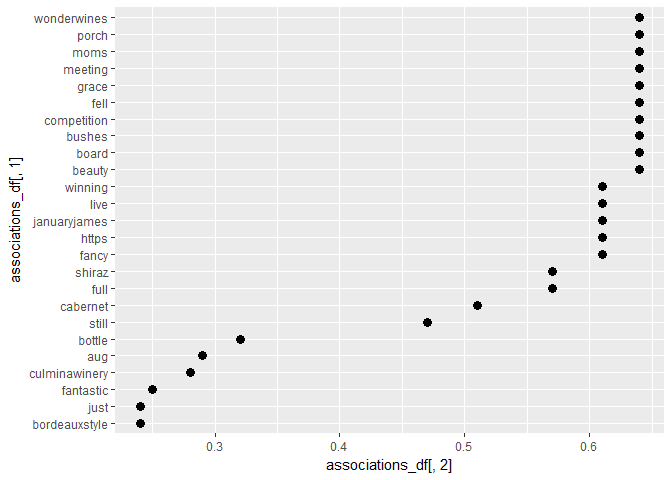
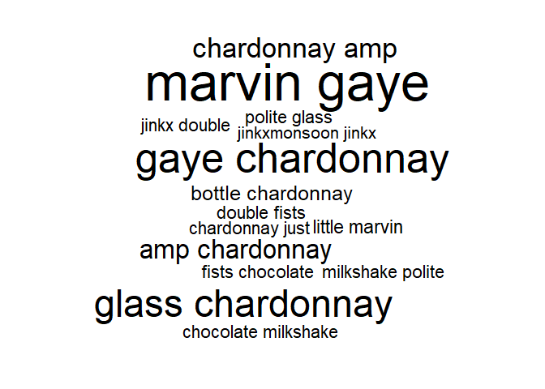

Adding to your tm skills
================
Mark Blackmore
2018-01-09

-   [Distance matrix and dendrogram](#distance-matrix-and-dendrogram)
-   [Make a distance matrix and dendrogram from a TDM](#make-a-distance-matrix-and-dendrogram-from-a-tdm)
-   [Put it all together: a text based dendrogram](#put-it-all-together-a-text-based-dendrogram)
-   [Dendrogram aesthetics](#dendrogram-aesthetics)
-   [Using word association](#using-word-association)
-   [Getting past single words](#getting-past-single-words)
-   [How do bigrams affect word clouds?](#how-do-bigrams-affect-word-clouds)
-   [Changing frequency weights](#changing-frequency-weights)
-   [Capturing metadata](#capturing-metadata)

``` r
# Load Packages
suppressWarnings(
  suppressPackageStartupMessages({
    library(qdap)
    library(tm)
    library(wordcloud)
    library(dendextend)
    library(tidyverse)
    library(RWeka)
  })
)
```

### Distance matrix and dendrogram

``` r
# Create sample data 
rain <- data.frame(city = c("Cleveland", "Portland", "Boston", "New Orleans"),
                   rainfall = c(39.14, 39.14, 43.77, 62.45))

# Create dist_rain
dist_rain <- dist(rain[,2])

# View the distance matrix
dist_rain
```

    ##       1     2     3
    ## 2  0.00            
    ## 3  4.63  4.63      
    ## 4 23.31 23.31 18.68

``` r
# Create hc
hc <- hclust(dist_rain)

# Plot hc
plot(hc, labels = rain$city)  
```


### Make a distance matrix and dendrogram from a TDM

``` r
# Import text data
tweets <- read.csv("./data/chardonnay.csv", stringsAsFactors = FALSE)

# Isolate text from tweets: coffee_tweets
chardonnay_tweets <- tweets$text

# Make a vector source: coffee_source
chardonnay_source <- VectorSource(chardonnay_tweets)

# Make a volatile corpus: chardonnay_corpus
chardonnay_corpus <- VCorpus(chardonnay_source)

# Pre-processing function
clean_corpus <- function(corpus){
  corpus <- tm_map(corpus, removePunctuation)
  corpus <- tm_map(corpus, content_transformer(tolower))
  corpus <- tm_map(corpus, removeWords, c(stopwords("en")))
  corpus <- tm_map(corpus, stripWhitespace)
  return(corpus)
}

# Apply your customized function to the tweet_corp: clean_corp
clean_corp <- clean_corpus(chardonnay_corpus)

# Create a TDM from clean_corp: chardonnay_tdm
chardonnay_tdm <- TermDocumentMatrix(clean_corp)

# Rename the file to match DataCamp
tweets_tdm <- chardonnay_tdm

# Create tdm1
tdm1 <- removeSparseTerms(tweets_tdm, sparse = 0.95)

# Create tdm2
tdm2 <- removeSparseTerms(tweets_tdm, sparse = 0.975)

# Print tdm1
tdm1
```

    ## <<TermDocumentMatrix (terms: 8, documents: 1000)>>
    ## Non-/sparse entries: 1360/6640
    ## Sparsity           : 83%
    ## Maximal term length: 10
    ## Weighting          : term frequency (tf)

``` r
# Print tdm2
tdm2
```

    ## <<TermDocumentMatrix (terms: 15, documents: 1000)>>
    ## Non-/sparse entries: 1600/13400
    ## Sparsity           : 89%
    ## Maximal term length: 10
    ## Weighting          : term frequency (tf)

Note: DataCamp's version of tweets\_tdm is different than the version derived here from the given source data.

### Put it all together: a text based dendrogram

``` r
# Create tweets_tdm2
tweets_tdm2 <- removeSparseTerms(tweets_tdm, sparse = 0.975)

# Create tdm_m
tdm_m <- as.matrix(tweets_tdm2)

# Create tdm_df
tdm_df <- as.data.frame(tdm_m)

# Create tweets_dist
tweets_dist <- dist(tdm_df)

# Create hc
hc <- hclust(tweets_dist)

# Plot the dendrogram
plot(hc)  
```


### Dendrogram aesthetics

``` r
# Load dendextend
#library(dendextend)

# Create hc
hc <- hclust(tweets_dist)

# Create hcd
hcd <- as.dendrogram(hc)

# Print the labels in hcd
labels(hcd)
```

    ##  [1] "chardonnay" "wine"       "just"       "like"       "glass"     
    ##  [6] "lol"        "bottle"     "rose"       "little"     "get"       
    ## [11] "2011"       "dont"       "amp"        "gaye"       "marvin"

``` r
# Change the branch color to red for "marvin" and "gaye"
# Note color does not work here or on DataCamp
branches_attr_by_labels(hcd, c("marvin", "gaye"), color = "red")
```

    ## 'dendrogram' with 2 branches and 15 members total, at height 29.54657

``` r
# Plot hcd
plot(hcd, main = "Better Dendrogram")

# Add cluster rectangles 
rect.dendrogram(hcd, k = 2, border = "grey50")
```


### Using word association

``` r
# Create associations
associations <- findAssocs(tweets_tdm, "rose", 0.2)

# View the venti associations
associations
```

    ## $rose
    ##        beauty         board        bushes   competition          fell 
    ##          0.64          0.64          0.64          0.64          0.64 
    ##         grace       meeting          moms         porch   wonderwines 
    ##          0.64          0.64          0.64          0.64          0.64 
    ##         fancy         https  januaryjames          live       winning 
    ##          0.61          0.61          0.61          0.61          0.61 
    ##          full        shiraz      cabernet         still        bottle 
    ##          0.57          0.57          0.51          0.47          0.32 
    ##           aug culminawinery     fantastic bordeauxstyle          just 
    ##          0.29          0.28          0.25          0.24          0.24

``` r
# Create associations_df
associations_df <- list_vect2df(associations)[, 2:3]

# Plot the associations_df values (don't change this)
ggplot(associations_df, aes(y = associations_df[, 1])) + 
  geom_point(aes(x = associations_df[, 2]), 
             data = associations_df, size = 3)
```



### Getting past single words

``` r
text_corp <- clean_corp

# Make tokenizer function 
tokenizer <- function(x) 
  NGramTokenizer(x, Weka_control(min = 2, max = 2))

# Create unigram_dtm
unigram_dtm <- DocumentTermMatrix(text_corp)

# Create bigram_dtm
bigram_dtm <- DocumentTermMatrix(text_corp, control = list(tokenize = tokenizer))

# Examine unigram_dtm
unigram_dtm
```

    ## <<DocumentTermMatrix (documents: 1000, terms: 3140)>>
    ## Non-/sparse entries: 8328/3131672
    ## Sparsity           : 100%
    ## Maximal term length: 530
    ## Weighting          : term frequency (tf)

``` r
# Examine bigram_dtm
bigram_dtm
```

    ## <<DocumentTermMatrix (documents: 1000, terms: 5546)>>
    ## Non-/sparse entries: 8126/5537874
    ## Sparsity           : 100%
    ## Maximal term length: 535
    ## Weighting          : term frequency (tf)

### How do bigrams affect word clouds?

``` r
# Create bigram_dtm_m
bigram_dtm_m <- as.matrix(bigram_dtm)

# Create freq
freq <- colSums(bigram_dtm_m)

# Create bi_words
bi_words <- names(freq)

# Examine part of bi_words
bi_words[2577:2587]
```

    ##  [1] "im liking"  "im longer"  "im north"   "im okay"    "im pearse" 
    ##  [6] "im phone"   "im playing" "im pretty"  "im retar"   "im salty"  
    ## [11] "im set"

``` r
# Plot a wordcloud
wordcloud(bi_words, freq, max.words = 15)
```



### Changing frequency weights

``` r
# Create tf_tdm
tf_tdm <- TermDocumentMatrix(text_corp)

# Create tfidf_tdm
tfidf_tdm <- TermDocumentMatrix(text_corp, control = list(weighting = weightTfIdf))

# Create tf_tdm_m
tf_tdm_m <- as.matrix(tf_tdm)

# Create tfidf_tdm_m 
tfidf_tdm_m <- as.matrix(tfidf_tdm)

# Examine part of tf_tdm_m
tf_tdm_m[508:509, 5:10]
```

    ##        Docs
    ## Terms   5 6 7 8 9 10
    ##   claim 0 0 0 0 0  0
    ##   clam  0 0 0 0 0  0

``` r
# Examine part of tfidf_tdm_m
tfidf_tdm_m[508:509, 5:10]
```

    ##        Docs
    ## Terms   5 6 7 8 9 10
    ##   claim 0 0 0 0 0  0
    ##   clam  0 0 0 0 0  0

### Capturing metadata

``` r
# Select specific columns
tweets <- tweets[, c("X", "text", "screenName", "created")]

# Rename columns
names(tweets)[1] <- "doc_id"

# Set the data frame source schema: docs
docs <- DataframeSource(tweets)

# Make a clean volatile corpus: text_corpus
text_corpus <- clean_corpus(VCorpus(docs))

# Print the first doc's doc_id  
text_corpus[[1]]$meta$id
```

    ## [1] "1"

``` r
# Examine the first doc content
text_corpus[[1]]$content
```

    ## [1] "rt oceanclub eilisohanlon stonyjim vonprond eilis im pearse st even can tell chardonnay smells like cats pee "

``` r
# Access the first doc metadata
meta(text_corpus[1])
```

    ##        screenName             created
    ## 1 KarenMMcCormack 2013-08-08 11:48:18
