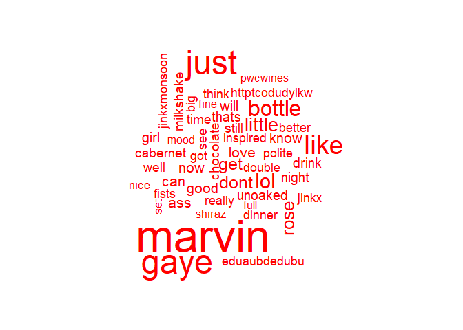
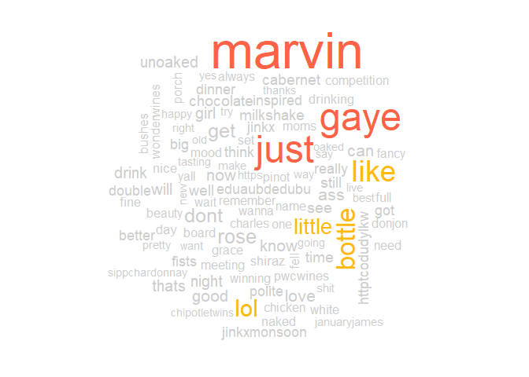
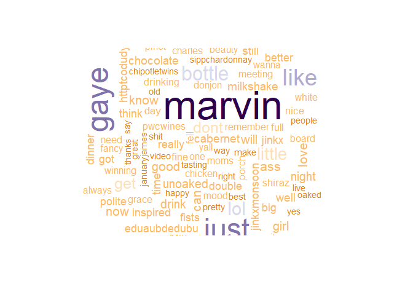

Word Clouds
================
Mark Blackmore
2018-01-09

-   [Frequent Terms with `tm`](#frequent-terms-with-tm)
-   [Frequent Terms with `qdap`](#frequent-terms-with-qdap)
-   [A Simple Word Cloud](#a-simple-word-cloud)
-   [Stop Words and Word Clouds](#stop-words-and-word-clouds)
-   [Plot the Better Word Cloud](#plot-the-better-word-cloud)
-   [Improve Word Cloud Colors](#improve-word-cloud-colors)
-   [Use Prebuilt Color Palettes](#use-prebuilt-color-palettes)
-   [Session info](#session-info)

### Frequent Terms with `tm`

``` r
# Read saved matrix, coerced from tdm
coffee_m  <- readRDS("coffee_m.RDS")

# Calculate the rowSums: term_frequency
term_frequency <- rowSums(coffee_m)

# Sort term_frequency in descending order
term_frequency <- sort(term_frequency, decreasing = TRUE)

# View the top 10 most common words
term_frequency[1:10]
```

    ##     like      cup     shop     just      get  morning     want drinking 
    ##      111      103       69       66       62       57       49       47 
    ##      can    looks 
    ##       45       45

``` r
# Plot a barchart of the 10 most common words
barplot(term_frequency[1:10], col = "tan", las = 2 )
```


### Frequent Terms with `qdap`

``` r
# Load qdap
suppressWarnings(
  suppressPackageStartupMessages(
    library(qdap)
  )
)

# Import text data
tweets <- read.csv("./data/coffee.csv", stringsAsFactors = FALSE)

# Create frequency
frequency <- freq_terms(
  tweets$text, 
  top = 10,
  at.least = 3,
  stopwords = "Top200Words")

# Make a frequency barchart
plot(frequency)
```


``` r
# Create frequency2
frequency2 <- freq_terms(
  tweets$text, 
  top = 10,
  at.least = 3,
  stopwords = tm::stopwords("english"))

# Make a frequency2 barchart
plot(frequency2)
```


### A Simple Word Cloud

#### Import and pre-process a new data set

``` r
# Load tm
suppressWarnings(
  suppressPackageStartupMessages(
    library(tm)
  )
)

# Import text data
tweets <- read.csv("./data/chardonnay.csv", stringsAsFactors = FALSE)

# Isolate text from tweets: coffee_tweets
chardonnay_tweets <- tweets$text

# Make a vector source: coffee_source
chardonnay_source <- VectorSource(chardonnay_tweets)

# Make a volatile corpus: chardonnay_corpus
chardonnay_corpus <- VCorpus(chardonnay_source)

# Pre-processing function
clean_corpus <- function(corpus){
  corpus <- tm_map(corpus, removePunctuation)
  corpus <- tm_map(corpus, content_transformer(tolower))
  corpus <- tm_map(corpus, removeWords, c(stopwords("en")))
  corpus <- tm_map(corpus, stripWhitespace)
  return(corpus)
}

# Apply your customized function to the tweet_corp: clean_corp
clean_corp <- clean_corpus(chardonnay_corpus)

# Create a TDM from clean_corp: chardonnay_tdm
chardonnay_tdm <- TermDocumentMatrix(clean_corp)

  
chardonnay_m <- as.matrix(chardonnay_tdm)

# Calculate the rowSums: term_frequenc
term_frequency <- rowSums(chardonnay_m)
term_frequency <- sort(term_frequency,
                       decreasing = TRUE) 

# Load wordcloud package
library(wordcloud)

# Print the first 10 entries in term_frequency
term_frequency[1:10]
```

    ## chardonnay        amp     marvin       wine       gaye       just 
    ##        820        120        104         83         76         75 
    ##      glass       like     bottle        lol 
    ##         63         55         47         43

``` r
# Create word_freqs
word_freqs <-  data.frame(term = names(term_frequency),
                          num = term_frequency)

# Create a wordcloud for the values in word_freqs
wordcloud(word_freqs$term, word_freqs$num, max.word = 100, color = "red")
```


### Stop Words and Word Clouds

``` r
# Add new stop words to clean_corpus()
clean_corpus <- function(corpus){
  corpus <- tm_map(corpus, removePunctuation)
  corpus <- tm_map(corpus, stripWhitespace)
  corpus <- tm_map(corpus, removeNumbers)
  corpus <- tm_map(corpus, content_transformer(tolower))
  corpus <- tm_map(corpus, removeWords, 
                   c(stopwords("en"), "amp", "chardonnay", "wine", "glass"))
  return(corpus)
}

# Create clean_chardonnay
clean_chardonnay <- clean_corpus(chardonnay_corpus)

# Create chardonnay_tdm
chardonnay_tdm <- TermDocumentMatrix(clean_chardonnay)

# Create chardonnay_m
chardonnay_m <- as.matrix(chardonnay_tdm)

# Create chardonnay_words
chardonnay_words <- rowSums(chardonnay_m)
```

### Plot the Better Word Cloud

``` r
# Sort the chardonnay_words in descending order
chardonnay_words <- sort(chardonnay_words, decreasing = TRUE)

# Print the 6 most frequent chardonnay terms
chardonnay_words[1:6]
```

    ## marvin   gaye   just   like bottle    lol 
    ##    104     76     75     55     47     43

``` r
# Create chardonnay_freqs
chardonnay_freqs <- data.frame(term = names(chardonnay_words),
                               num = chardonnay_words)

# Create a wordcloud for the values in word_freqs
wordcloud(chardonnay_freqs$term, chardonnay_freqs$num,
          max.word = 50, colors = "red")
```



### Improve Word Cloud Colors

``` r
# Print the list of colors
colors()[1:10]
```

    ##  [1] "white"         "aliceblue"     "antiquewhite"  "antiquewhite1"
    ##  [5] "antiquewhite2" "antiquewhite3" "antiquewhite4" "aquamarine"   
    ##  [9] "aquamarine1"   "aquamarine2"

``` r
# Print the wordcloud with the specified colors
wordcloud(chardonnay_freqs$term, 
          chardonnay_freqs$num, 
          max.words = 100, 
          colors = c("grey80", "darkgoldenrod1", "tomato"))
```



### Use Prebuilt Color Palettes

``` r
# List the available colors
display.brewer.all()
```


``` r
# Create purple_orange
purple_orange <- brewer.pal(10, "PuOr")

# Drop 2 faintest colors
purple_orange <- purple_orange[-(1:2)]

# Create a wordcloud with purple_orange palette
wordcloud(chardonnay_freqs$term, chardonnay_freqs$num, 
          max.words = 100, colors = purple_orange)
```



------------------------------------------------------------------------

Session info
------------

``` r
sessionInfo()   
```

    ## R version 3.4.2 (2017-09-28)
    ## Platform: x86_64-w64-mingw32/x64 (64-bit)
    ## Running under: Windows 10 x64 (build 16299)
    ## 
    ## Matrix products: default
    ## 
    ## locale:
    ## [1] LC_COLLATE=English_United States.1252 
    ## [2] LC_CTYPE=English_United States.1252   
    ## [3] LC_MONETARY=English_United States.1252
    ## [4] LC_NUMERIC=C                          
    ## [5] LC_TIME=English_United States.1252    
    ## 
    ## attached base packages:
    ## [1] stats     graphics  grDevices utils     datasets  methods   base     
    ## 
    ## other attached packages:
    ## [1] wordcloud_2.5          tm_0.7-3               NLP_0.1-11            
    ## [4] qdap_2.2.9             RColorBrewer_1.1-2     qdapTools_1.3.3       
    ## [7] qdapRegex_0.7.2        qdapDictionaries_1.0.6
    ## 
    ## loaded via a namespace (and not attached):
    ##  [1] gtools_3.5.0        venneuler_1.1-0     slam_0.1-40        
    ##  [4] reshape2_1.4.2      rJava_0.9-9         reports_0.1.4      
    ##  [7] colorspace_1.3-2    htmltools_0.3.6     yaml_2.1.14        
    ## [10] chron_2.3-51        XML_3.98-1.9        rlang_0.1.2        
    ## [13] glue_1.1.1          bindrcpp_0.2        bindr_0.1          
    ## [16] plyr_1.8.4          stringr_1.2.0       munsell_0.4.3      
    ## [19] gtable_0.2.0        evaluate_0.10.1     labeling_0.3       
    ## [22] knitr_1.17          gender_0.5.1        parallel_3.4.2     
    ## [25] xlsxjars_0.6.1      Rcpp_0.12.13        backports_1.1.1    
    ## [28] scales_0.5.0        gdata_2.18.0        plotrix_3.7        
    ## [31] xlsx_0.5.7          openNLPdata_1.5.3-4 gridExtra_2.3      
    ## [34] ggplot2_2.2.1       digest_0.6.12       stringi_1.1.5      
    ## [37] dplyr_0.7.4         grid_3.4.2          rprojroot_1.2      
    ## [40] tools_3.4.2         bitops_1.0-6        magrittr_1.5       
    ## [43] RCurl_1.95-4.8      lazyeval_0.2.0      tibble_1.3.4       
    ## [46] pkgconfig_2.0.1     xml2_1.1.1          data.table_1.10.4-2
    ## [49] assertthat_0.2.0    rmarkdown_1.6       openNLP_0.2-6      
    ## [52] R6_2.2.2            igraph_1.1.2        compiler_3.4.2
