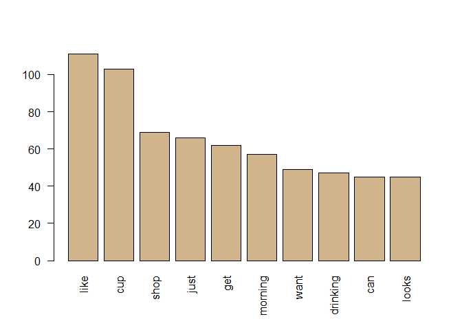

Word Clouds and More Interesting Visuals
================
Mark Blackmore
2018-01-03

-   [Frequent Terms with `tm`](#frequent-terms-with-tm)

### Frequent Terms with `tm`

``` r
#coffee_tdm <- readRDS("coffee_tdm.RDS")
coffee_m    <- readRDS("coffee_m.RDS")


# Create a matrix: coffee_m
#coffee_m <- as.matrix(coffee_tdm)

# Calculate the rowSums: term_frequency
term_frequency <- rowSums(coffee_m)

# Sort term_frequency in descending order
term_frequency <- sort(term_frequency, decreasing = TRUE)

# View the top 10 most common words
term_frequency[1:10]
```

    ##     like      cup     shop     just      get  morning     want drinking 
    ##      111      103       69       66       62       57       49       47 
    ##      can    looks 
    ##       45       45

``` r
# Plot a barchart of the 10 most common words
barplot(term_frequency[1:10], col = "tan", las = 2 )
```


