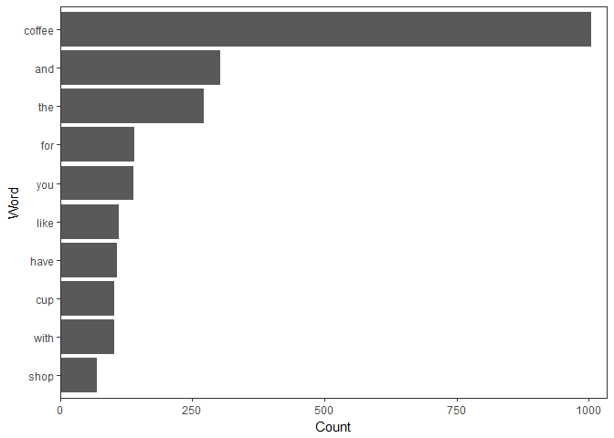
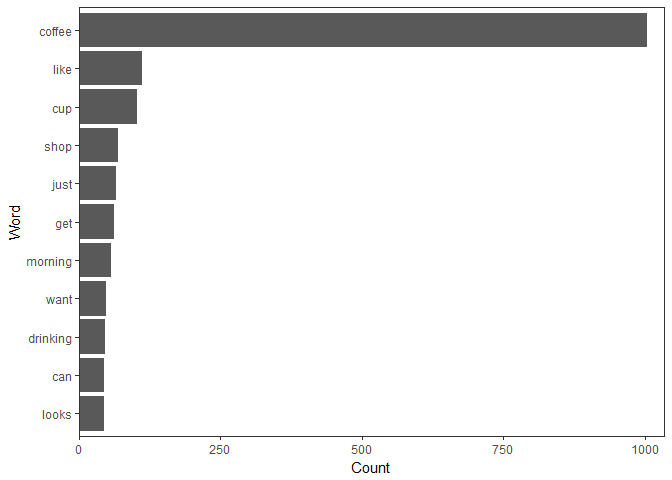
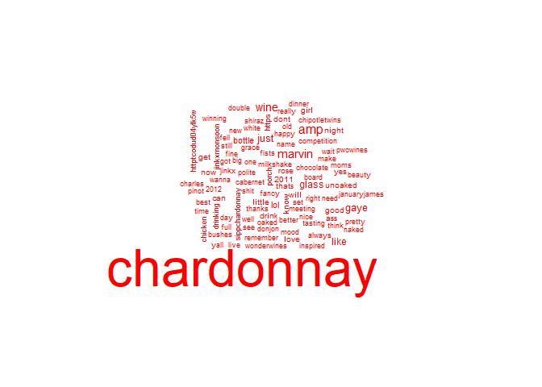
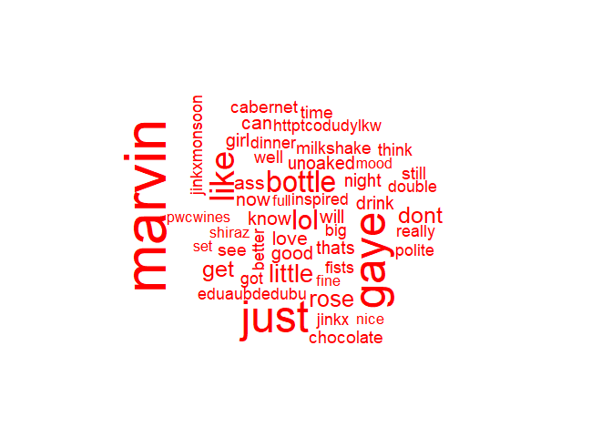

Word Clouds and More Interesting Visuals
================
Mark Blackmore
2018-01-04

-   [Frequent Terms with `tm`](#frequent-terms-with-tm)
-   [Frequent Terms with `qdap`](#frequent-terms-with-qdap)
-   [A Simple Word Cloud](#a-simple-word-cloud)
-   [Stop Words and Word Clouds](#stop-words-and-word-clouds)
-   [Plot the Better Word Cloud](#plot-the-better-word-cloud)

### Frequent Terms with `tm`

``` r
# Read saved matrix, coerced from tdm
coffee_m  <- readRDS("coffee_m.RDS")

# Calculate the rowSums: term_frequency
term_frequency <- rowSums(coffee_m)

# Sort term_frequency in descending order
term_frequency <- sort(term_frequency, decreasing = TRUE)

# View the top 10 most common words
term_frequency[1:10]
```

    ##     like      cup     shop     just      get  morning     want drinking 
    ##      111      103       69       66       62       57       49       47 
    ##      can    looks 
    ##       45       45

``` r
# Plot a barchart of the 10 most common words
barplot(term_frequency[1:10], col = "tan", las = 2 )
```


### Frequent Terms with `qdap`

``` r
# Load qdap
suppressWarnings(
  suppressPackageStartupMessages(
    library(qdap)
  )
)

# Import text data
tweets <- read.csv("./data/coffee.csv", stringsAsFactors = FALSE)

# Create frequency
frequency <- freq_terms(
  tweets$text, 
  top = 10,
  at.least = 3,
  stopwords = "Top200Words")

# Make a frequency barchart
plot(frequency)
```



``` r
# Create frequency2
frequency2 <- freq_terms(
  tweets$text, 
  top = 10,
  at.least = 3,
  stopwords = tm::stopwords("english"))

# Make a frequency2 barchart
plot(frequency2)
```



### A Simple Word Cloud

#### Import and pre-process a new data set

``` r
# Load tm
suppressWarnings(
  suppressPackageStartupMessages(
    library(tm)
  )
)

# Import text data
tweets <- read.csv("./data/chardonnay.csv", stringsAsFactors = FALSE)

# Isolate text from tweets: coffee_tweets
chardonnay_tweets <- tweets$text

# Make a vector source: coffee_source
chardonnay_source <- VectorSource(chardonnay_tweets)

# Make a volatile corpus: coffee_corpus
chardonnay_corpus <- VCorpus(chardonnay_source)

# Pre-processing function
clean_corpus <- function(corpus){
  corpus <- tm_map(corpus, removePunctuation)
  corpus <- tm_map(corpus, content_transformer(tolower))
  corpus <- tm_map(corpus, removeWords, c(stopwords("en")))
  corpus <- tm_map(corpus, stripWhitespace)
  return(corpus)
}

# Apply your customized function to the tweet_corp: clean_corp
clean_corp <- clean_corpus(chardonnay_corpus)

# Create a TDM from clean_corp: coffee_tdm
chardonnay_tdm <- TermDocumentMatrix(clean_corp)

chardonnay_m <- as.matrix(chardonnay_tdm)

# Calculate the rowSums: term_frequenc
term_frequency <- rowSums(chardonnay_m)
term_frequency <- sort(term_frequency,
                       decreasing = TRUE) 

# Load wordcloud package
library(wordcloud)

# Print the first 10 entries in term_frequency
term_frequency[1:10]
```

    ## chardonnay        amp     marvin       wine       gaye       just 
    ##        820        120        104         83         76         75 
    ##      glass       like     bottle        lol 
    ##         63         55         47         43

``` r
# Create word_freqs
word_freqs <-  data.frame(term = names(term_frequency),
                          num = term_frequency)

# Create a wordcloud for the values in word_freqs
wordcloud(word_freqs$term, word_freqs$num, max.word = 100, color = "red")
```



### Stop Words and Word Clouds

``` r
# Add new stop words to clean_corpus()
clean_corpus <- function(corpus){
  corpus <- tm_map(corpus, removePunctuation)
  corpus <- tm_map(corpus, stripWhitespace)
  corpus <- tm_map(corpus, removeNumbers)
  corpus <- tm_map(corpus, content_transformer(tolower))
  corpus <- tm_map(corpus, removeWords, 
                   c(stopwords("en"), "amp", "chardonnay", "wine", "glass"))
  return(corpus)
}

# Create clean_chardonnay
clean_chardonnay <- clean_corpus(chardonnay_corpus)

# Create chardonnay_tdm
chardonnay_tdm <- TermDocumentMatrix(clean_chardonnay)

# Create chardonnay_m
chardonnay_m <- as.matrix(chardonnay_tdm)

# Create chardonnay_words
chardonnay_words <- rowSums(chardonnay_m)
```

### Plot the Better Word Cloud

``` r
# Sort the chardonnay_words in descending order
chardonnay_words <- sort(chardonnay_words, decreasing = TRUE)

# Print the 6 most frequent chardonnay terms
chardonnay_words[1:6]
```

    ## marvin   gaye   just   like bottle    lol 
    ##    104     76     75     55     47     43

``` r
# Create chardonnay_freqs
chardonnay_freqs <- data.frame(term = names(chardonnay_words),
                               num = chardonnay_words)

# Create a wordcloud for the values in word_freqs
wordcloud(chardonnay_freqs$term, chardonnay_freqs$num,
          max.word = 50, colors = "red")
```


