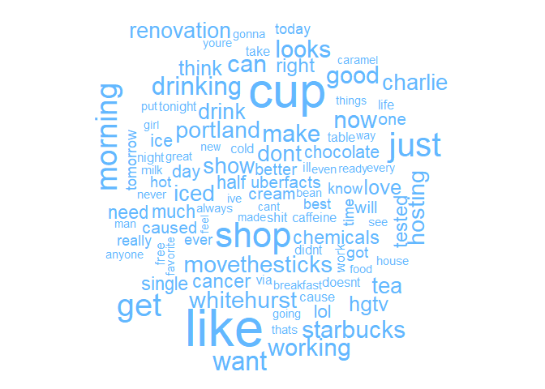

More Word Visuals
================
Mark Blackmore
2018-01-05

-   [Find Common Words](#find-common-words)
-   [Visualize Common Words](#visualize-common-words)
-   [Session info](#session-info)

``` r
# Load Packages
suppressWarnings(
  suppressPackageStartupMessages({
    library(qdap)
    library(tm)
    library(wordcloud)
  })
)
```

### Find Common Words

``` r
# Load Data
coffee_tweets <- read.csv("./data/coffee.csv", stringsAsFactors = FALSE)
chardonnay_tweets <- read.csv("./data/coffee.csv", stringsAsFactors = FALSE)

# Create all_coffee
all_coffee <- paste(coffee_tweets$text, collapse = " ")

# Create all_chardonnay
all_chardonnay <- paste(chardonnay_tweets$text, collapse = " ")

# Create all_tweets
all_tweets <- c(all_coffee, all_chardonnay)

# Convert to a vector source
all_tweets <- VectorSource(all_tweets)

# Create all_corpus
all_corpus <- VCorpus(all_tweets)
```

### Visualize Common Words

``` r
# Cleaning Function
clean_corpus <- function(corpus){
  corpus <- tm_map(corpus, removePunctuation)
  corpus <- tm_map(corpus, stripWhitespace)
  corpus <- tm_map(corpus, removeNumbers)
  corpus <- tm_map(corpus, content_transformer(tolower))
  corpus <- tm_map(corpus, removeWords, c(stopwords("en"), "amp", "glass", "chardonnay", "coffee"))
  return(corpus)
}

# Clean the corpus
all_clean <- clean_corpus(all_corpus)

# Create all_tdm
all_tdm <- TermDocumentMatrix(all_clean)

# Create all_m
all_m <- as.matrix(all_tdm)

# Print a commonality cloud
commonality.cloud(all_m, max.words = 100, colors = "steelblue1")
```



------------------------------------------------------------------------

Session info
------------

``` r
sessionInfo()   
```

    ## R version 3.4.2 (2017-09-28)
    ## Platform: x86_64-w64-mingw32/x64 (64-bit)
    ## Running under: Windows 10 x64 (build 16299)
    ## 
    ## Matrix products: default
    ## 
    ## locale:
    ## [1] LC_COLLATE=English_United States.1252 
    ## [2] LC_CTYPE=English_United States.1252   
    ## [3] LC_MONETARY=English_United States.1252
    ## [4] LC_NUMERIC=C                          
    ## [5] LC_TIME=English_United States.1252    
    ## 
    ## attached base packages:
    ## [1] stats     graphics  grDevices utils     datasets  methods   base     
    ## 
    ## other attached packages:
    ## [1] wordcloud_2.5          tm_0.7-3               NLP_0.1-11            
    ## [4] qdap_2.2.9             RColorBrewer_1.1-2     qdapTools_1.3.3       
    ## [7] qdapRegex_0.7.2        qdapDictionaries_1.0.6
    ## 
    ## loaded via a namespace (and not attached):
    ##  [1] gtools_3.5.0        venneuler_1.1-0     slam_0.1-40        
    ##  [4] reshape2_1.4.2      rJava_0.9-9         reports_0.1.4      
    ##  [7] colorspace_1.3-2    htmltools_0.3.6     yaml_2.1.14        
    ## [10] chron_2.3-51        XML_3.98-1.9        rlang_0.1.2        
    ## [13] glue_1.1.1          bindrcpp_0.2        bindr_0.1          
    ## [16] plyr_1.8.4          stringr_1.2.0       munsell_0.4.3      
    ## [19] gtable_0.2.0        evaluate_0.10.1     knitr_1.17         
    ## [22] gender_0.5.1        parallel_3.4.2      xlsxjars_0.6.1     
    ## [25] Rcpp_0.12.13        backports_1.1.1     scales_0.5.0       
    ## [28] gdata_2.18.0        plotrix_3.7         xlsx_0.5.7         
    ## [31] openNLPdata_1.5.3-4 gridExtra_2.3       ggplot2_2.2.1      
    ## [34] digest_0.6.12       stringi_1.1.5       dplyr_0.7.4        
    ## [37] grid_3.4.2          rprojroot_1.2       tools_3.4.2        
    ## [40] bitops_1.0-6        magrittr_1.5        RCurl_1.95-4.8     
    ## [43] lazyeval_0.2.0      tibble_1.3.4        pkgconfig_2.0.1    
    ## [46] xml2_1.1.1          data.table_1.10.4-2 assertthat_0.2.0   
    ## [49] rmarkdown_1.6       openNLP_0.2-6       R6_2.2.2           
    ## [52] igraph_1.1.2        compiler_3.4.2
